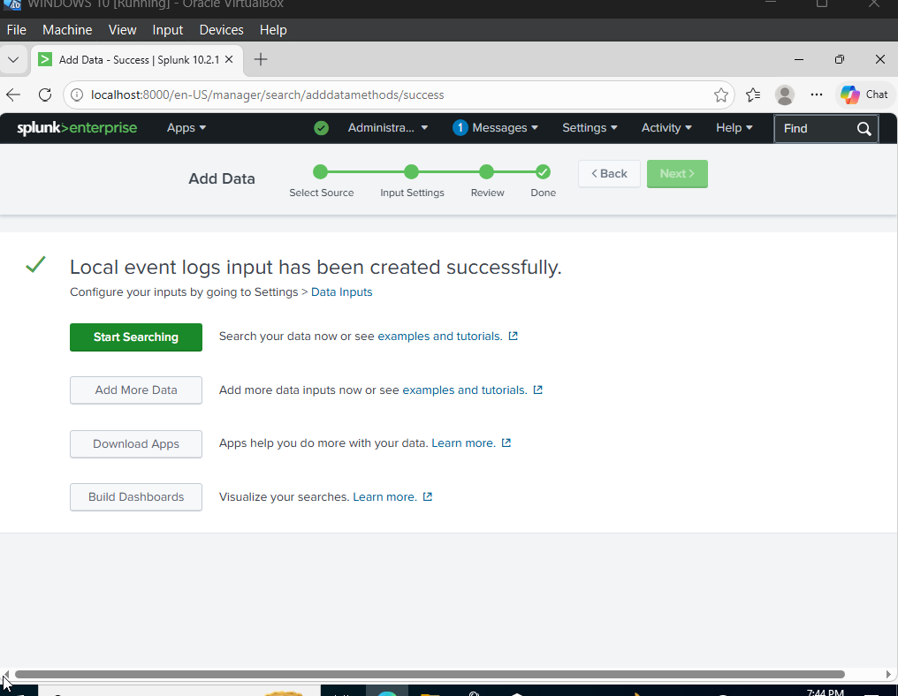
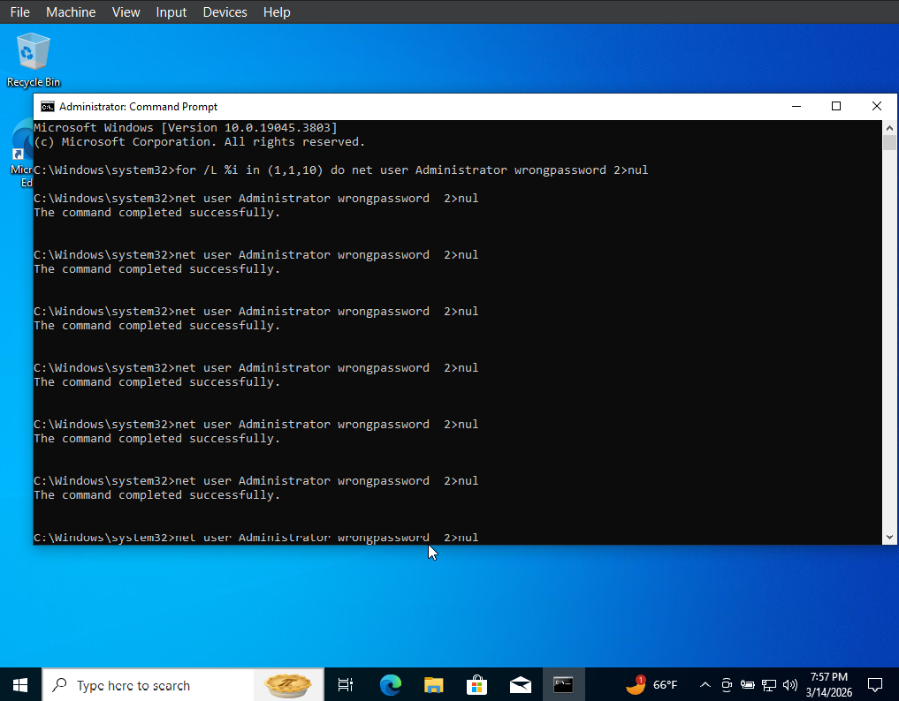
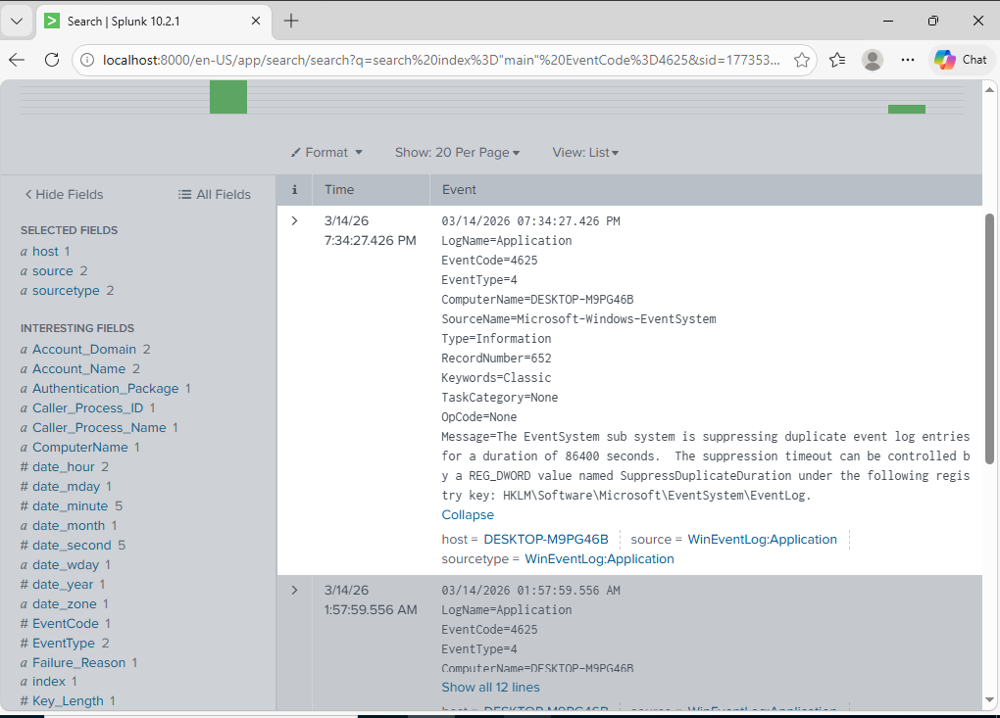
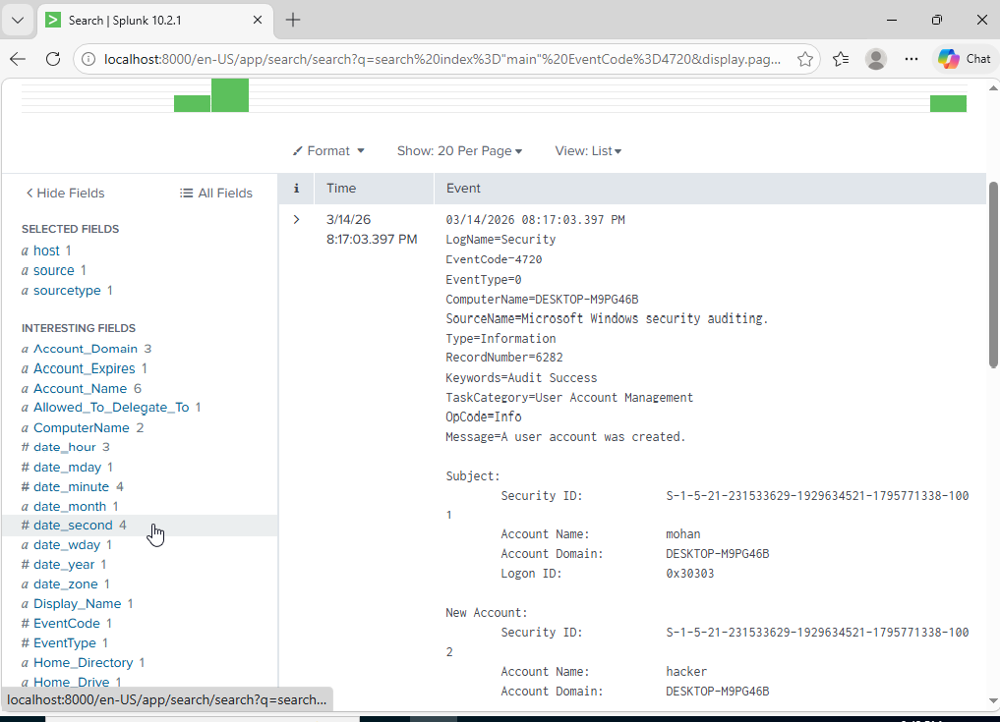
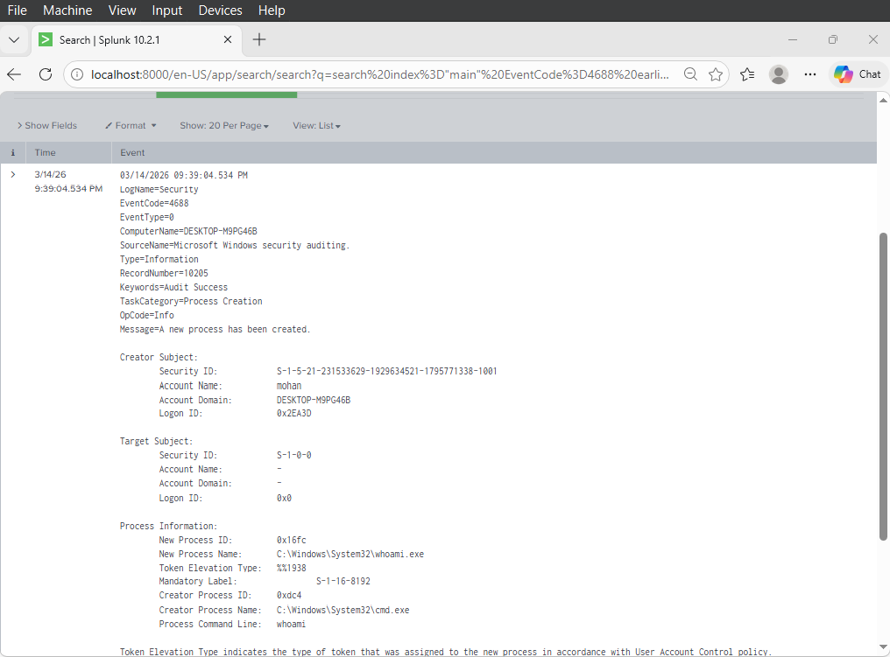
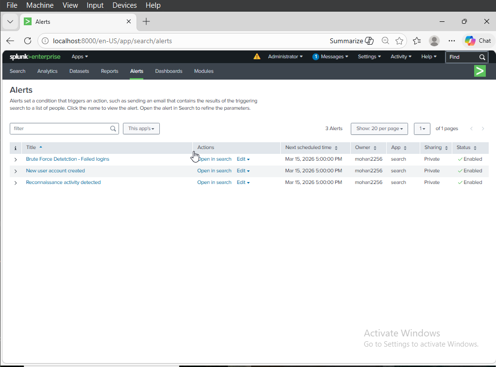

# 🛡️ Splunk Home SIEM Lab

A home lab where I built a SIEM using Splunk Free to detect real-world attack 
techniques on a Windows 10 machine. All detections are mapped to MITRE ATT&CK.

## 🖥️ Environment

- Hypervisor: Oracle VirtualBox
- OS: Windows 10 Pro
- SIEM: Splunk Enterprise (Free License)
- Logs: Windows Security, System, Application Event Logs

## ⚔️ What I Did

I simulated three attacks manually on the Windows 10 VM and built Splunk detection 
rules to catch each one.

**Attack 1 — Brute Force 🔓**
Ran 10 failed login attempts using CMD. Generates Event ID 4625.

**Attack 2 — New User Creation 👤**
Created a backdoor user account using CMD. Generates Event ID 4720.

**Attack 3 — Reconnaissance 🔍**
Ran whoami, ipconfig, netstat, systeminfo, tasklist. Generates Event ID 4688.

⚠️ Note: Event ID 4688 required enabling Process Creation Auditing and Command Line 
Logging via Group Policy and registry — Windows 10 does not log this by default.

## 🔍 Detection Rules

SPL queries for all detections → [detections/splunk-rules.md](detections/splunk-rules.md)

## 🗺️ MITRE ATT&CK Mapping

Full mapping → [mitre-mapping.md](mitre-mapping.md)

- Brute Force → T1110
- New User Created → T1136
- System Information Discovery → T1082
- Process Discovery → T1057

---

## 📸 Screenshots

### Logs Flowing in Splunk

### Brute Force Simulation

### Event ID 4625 — Failed Logins Detected

### Event ID 4720 — New User Detected

### Event ID 4688 — Recon Commands Detected

### Splunk Alerts 🔔

## 💡 Key Learnings

- Windows 10 doesn't log command line activity by default — needs manual Group Policy (GPO) configuration via gpedit.msc
- Splunk Free is enough for a single-machine home lab
- Every attack technique leaves a traceable Event ID in Windows logs
- Detection rules can be mapped directly to MITRE ATT&CK techniques

## 📚 References

- [Splunk Docs](https://docs.splunk.com)
- [MITRE ATT&CK](https://attack.mitre.org)
- [Windows Event ID Encyclopedia](https://www.ultimatewindowssecurity.com/securitylog/encyclopedia/)
  
📖 Read the full writeup on Medium → [How I Built a Home SIEM Lab with Splunk](https://medium.com/@mohankrishnaotikunta/how-i-built-a-home-siem-lab-with-splunk-and-everything-that-went-wrong-fd0ae7e98b52)
